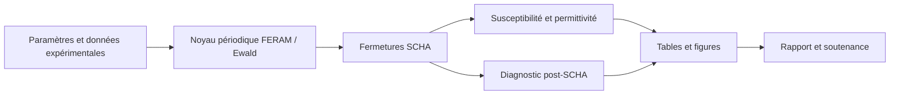

# Quantum paraelectrics — stage au SPMS

Rapport, soutenance et calculs de Maxime Devin–Pinson sur les Hamiltoniens
effectifs de BaTiO₃, SrTiO₃ et BaₓSr₁₋ₓTiO₃, l’approximation harmonique
auto-cohérente (SCHA) et la réponse diélectrique.

- [Rapport PDF](rapportCS_stage_maxime/output/pdf/rapportCS.pdf) et [sources LaTeX](rapportCS_stage_maxime/rapportCS.tex).
- [Soutenance PDF](soutenance_stage_beamer/soutenance_stage.pdf) et [sources Beamer](soutenance_stage_beamer/main.tex).
- [Bibliographie BibTeX](rapportCS_stage_maxime/biblio.bib).
- [Pipeline : installation, conventions et reproduction](python/scha_pipeline/README.md).



## Organisation

```text
rapportCS_stage_maxime/     Sources, bibliographie, images et rapport PDF
soutenance_stage_beamer/    Sources Beamer, illustrations et soutenance PDF
python/scha_pipeline/
  inputs/                  Configurations, données et tables de paramètres
  outputs/reference/       Résultats numériques livrés
  outputs/                 Nouveaux calculs locaux
  SCHA_paraelc/            Phase paraélectrique et scans T / pression / BST
  SCHA_ferro/              Branche ferroélectrique anisotrope
  Mayer/                   Paramétrisation PBEsol et diagnostic post-SCHA
  lattice_sum/             Sommes dipolaires d’Ewald
  tenseur_beta/, tenseur_C/ Tenseurs locaux et gradients
  tests/                   Vérifications numériques reproductibles
```

## Premier calcul

Avec Python 3.9 (environnement de référence : 3.9.6), depuis la racine :

```sh
python3.9 -m venv .venv
. .venv/bin/activate
python -m pip install -r python/scha_pipeline/requirements.txt
python python/scha_pipeline/run_pipeline.py
```

Le calcul à 500 K écrit ses entrées, la solution et la réponse diélectrique
dans `python/scha_pipeline/outputs/example/`.

## Compiler les documents

Une distribution TeX Live complète est recommandée, avec `pdflatex` et `bibtex`.

```sh
sh rapportCS_stage_maxime/compile.sh
sh soutenance_stage_beamer/compile.sh
```

Les illustrations nécessaires sont incluses ; la compilation des documents
ne nécessite pas de relancer les simulations.

Les figures empruntées à la littérature conservent leurs attributions dans
les légendes et diapositives. La bibliographie indique les sources des
paramétrisations et des comparaisons expérimentales. Les calculs post-SCHA
sont des diagnostics perturbatifs ; leurs limites et les approximations des
fermetures sont détaillées dans le rapport et le README scientifique.
