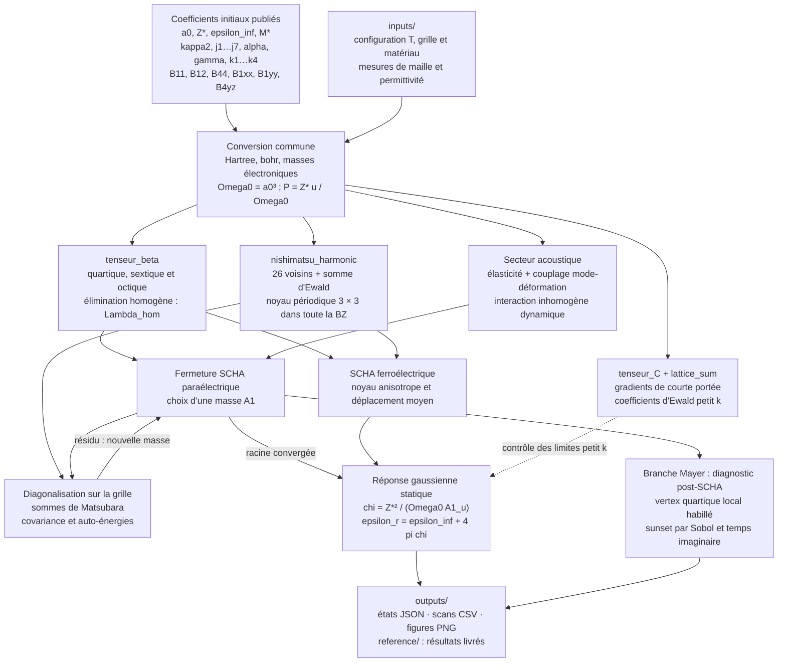

# Pipeline SCHA : fonctionnement et utilisation

La pipeline construit le noyau périodique des Hamiltoniens effectifs
Zhong–Vanderbilt–Rabe et Nishimatsu/FERAM, résout des fermetures SCHA et calcule
la susceptibilité diélectrique intrinsèque de BaTiO₃ et SrTiO₃. Elle comprend
une extension VCA aux alliages BST, une branche BaTiO₃ paramétrée par Mayer
et un diagnostic quartique post-SCHA.

Le [rapport](../../../rapportCS_stage_maxime/rapportCS.tex) expose les
dérivations, les jeux de paramètres et les limites physiques. Voir aussi la
[page principale du dépôt](../../../README.md).

## Flux de calcul




Les étapes `tenseur_C` et `lattice_sum` permettent de reconstruire et de
contrôler les coefficients de basse énergie. Les intégrales SCHA utilisent
le noyau périodique complet, et non son approximation quadratique extrapolée
au bord de la zone de Brillouin. Les paramètres sont définis dans les modules
Python correspondants ; les tables CSV documentent les valeurs sources,
elles ne remplacent pas automatiquement ces définitions.

## Installation

Depuis la racine du dépôt, avec Python 3.9 (version de référence : 3.9.6) :

```sh
python3.9 -m venv .venv
. .venv/bin/activate
python -m pip install -r python/scha_pipeline/requirements.txt
```

Les versions NumPy, SciPy, SymPy et Matplotlib sont fixées dans
`requirements.txt`. Une installation des mêmes anciennes versions sous
Python 3.13 ou 3.14 n’est pas prévue.

## Exemple complet : un état paraélectrique

```sh
python python/scha_pipeline/run_pipeline.py \
  --input python/scha_pipeline/inputs/examples/batio3_500K.json \
  --output python/scha_pipeline/outputs/example
```

L’entrée contient le matériau (`nishimatsu`, `nishimatsu_sto` ou `vanderbilt`),
la température en kelvin, l’ordre pair `ngrid` de la quadrature dans chaque
direction et la tolérance du résidu en Ha/bohr². L’exemple calcule la fermeture
locale projetée à pression nulle. À 500 K et `ngrid=40`,
`A1 ≈ 0.00292641727 Ha/bohr²` pour Nishimatsu BaTiO₃.

Trois fichiers sont produits :

- `input.json` : copie de la configuration effectivement utilisée ;
- `scha.json` : coefficients, masse, boucle, résidu et diagnostics de stabilité ;
- `response.json` : susceptibilité gaussienne, permittivité relative et covariance physique.

On peut également utiliser directement le solveur et l’outil de réponse :

```sh
python python/scha_pipeline/SCHA_paraelc/scha_paraelc.py \
  --material nishimatsu --temperature 500 --ngrid 40 \
  --json python/scha_pipeline/outputs/example/scha.json
python python/scha_pipeline/dielec_response.py \
  --scha-json python/scha_pipeline/outputs/example/scha.json --limit-only
```

## Scans et figures

Toutes les commandes suivantes s’exécutent à la racine. Les sorties nouvelles
sont placées sous `outputs/` et ne remplacent pas `outputs/reference/`.

BaTiO₃ avec déformation acoustique inhomogène, pressions ajustées à la maille
et à la réponse expérimentales :

```sh
python python/scha_pipeline/SCHA_paraelc/scan_chi_temperature_inhomogeneous.py \
  --start 400 --stop 565 --step 5 --ngrid 40
```

SrTiO₃ et BST :

```sh
python python/scha_pipeline/SCHA_paraelc/scan_chi_temperature_srtio3.py \
  --start 400 --stop 565 --step 5 --ngrid 40
python python/scha_pipeline/SCHA_paraelc/scan_chi_temperature_bst_vca.py \
  --start 300 --stop 600 --step 5 --ngrid 40
```

La comparaison SrTiO₃ avec plusieurs lois de pression dispose aussi du script
`SCHA_paraelc/build_srtio3_pressure_comparison.py`.

Branche ferroélectrique à basse température :

```sh
python python/scha_pipeline/SCHA_ferro/scha_ferro.py \
  --temperature 10 --ngrid 20 --json python/scha_pipeline/outputs/example/ferro10.json
```

Mayer : calcul de référence, figure de comparaison et limites de stabilité
paraélectriques :

```sh
python python/scha_pipeline/Mayer/run_mayer_bto.py --start 400 --stop 800 --step 10 --ngrid 40
python python/scha_pipeline/Mayer/build_mayer_chi_figure.py
python python/scha_pipeline/Mayer/compute_a1_transition_table.py
```

Les deux dernières commandes lisent les tables livrées dans
`outputs/reference/mayer/` et écrivent sous `outputs/mayer/`. Le premier script
recalcule les solutions et leurs pressions ; `--stem` permet de nommer un
nouveau jeu de sorties. La figure simplifiée du beamer est générée par
`soutenance_stage_beamer/scripts/build_mayer_scha_slide_figure.py`.

Diagnostic post-SCHA à partir des solutions fraîchement calculées :

```sh
python python/scha_pipeline/Mayer/post_scha_quartic.py \
  --input python/scha_pipeline/outputs/mayer/mayer_bto_400_800K_n40.csv \
  --sample-power 12 --tau-order 24 --seed 20220812
```

Sans `--input`, le script lit la table de référence livrée. La quadrature
Sobol brouillée comporte `2**sample_power` couples de moments ; `tau_order`
contrôle l’intégration du temps imaginaire. La graine fixe assure la
reproductibilité, mais ne remplace pas les contrôles de convergence.

Pour les options complètes de chaque script, ajouter `--help`. Les scans
paraélectriques acceptent `--csv` et `--plot` pour choisir les sorties.

## Conventions scientifiques

| Quantité | Convention |
|---|---|
| Énergie, longueur | Hartree (Ha), bohr ; eV/Å convertis à l’entrée |
| Température, pression | kelvin, GPa à l’interface |
| Masse | masse électronique, après conversion depuis amu |
| Mode local et polarisation | `P = Z* u / Omega0`, `Omega0 = a0**3` |
| Noyau numérique | `A_u` en Ha/bohr² ; `A_P = (Omega0/Z*)**2 A_u` |
| Susceptibilité ionique | `chi = Z*²/(Omega0 A1_u) = Omega0/A1_P` |
| Permittivité | `epsilon_r = epsilon_inf + 4*pi*chi` (unités gaussiennes) |
| Voigt | `(xx, yy, zz, yz, xz, xy)`, cisaillements d’ingénieur |
| Fourier des champs | normalisation symétrique `1/sqrt(N)` |
| Fourier des noyaux | somme directe sans facteur ; inverse divisée par `N` |
| Zone de Brillouin | cube `[-pi/a0, pi/a0]³`, mesure `Omega0/(2*pi)³` |

Attention au nom `G` dans le JSON du solveur historique : il désigne la somme
intégrée `sum_n A_u^-1`, **sans** le facteur `kBT`. La covariance physique est
`C_u = kBT * G`. Le fichier `response.json` du point d’entrée fournit directement
cette covariance en bohr². Les propagateurs quantiques utilisent `hbar=1` et
`omega_n=2*pi*n*kBT` dans les unités atomiques.

Le quartique est écrit avec un facteur `1/4`, le sextique avec `1/6` et
l’octique avec `1/8` dans la convention tensorielle du rapport. Le Hessien de
`kappa2*u²` contient donc `2*kappa2`. Les jeux ZVR, Nishimatsu et Mayer sont
convertis avant construction du noyau. Pour Mayer, les invariants `k1` et `k4`
effectifs incluent l’élimination des modes optiques secondaires décrite dans
l’article ; les paramètres conventionnels restent explicitement disponibles.

## Vérifier une installation

```sh
python python/scha_pipeline/validate_pipeline.py --quick
python python/scha_pipeline/validate_pipeline.py
```

La première commande omet quatre contrôles coûteux. La seconde inclut la
convergence spatiale de plusieurs fermetures et la convergence en Matsubara
du prototype matriciel. Les deux exécutent également les tests Mayer. Un
échec renvoie un code non nul. Les caches de validation sont temporaires.

## Portée physique

Un résidu faible valide la résolution de l’équation discrétisée ; la
convergence en grille et la stabilité thermodynamique exigent des vérifications
distinctes. Avec le secteur acoustique dynamique, la fermeture scalaire
projette l’auto-énergie en Gamma ; elle ne garantit pas la minimisation exacte
de l’énergie libre variationnelle dans la famille à masse isotrope.
Les branches ferroélectriques ne sont pas sélectionnées par
comparaison complète des énergies libres. La réponse est intrinsèque et
monodomaine ; les parois de domaines et le mode antiferrodistortif de SrTiO₃
sont absents. Les pressions ajustées sont des calibrations de modèle.

Les courbes acoustiques BaTiO₃ emploient 46,44 amu pour leur reproduction,
contre 46,64 amu dans la Table I de Nishimatsu 2016. Le test à 500 K, pression
nulle et grille 40³ donne un effet inférieur à 0,0003 % sur la susceptibilité.

Les références BST de Curie–Weiss sont reconstruites d’après la littérature,
avec leurs incertitudes ; ce ne sont pas des séries de mesures brutes. Le
raccord de maille de Mayer repose sur l’ajustement Nakatani entre 413 et
598 K ; son prolongement au-delà est une extrapolation.

Le prototype matriciel `scan_chi_temperature_full_kernel.py` n’est pas convergé
spatialement aux petites grilles proposées. Le sunset Mayer est un diagnostic
local projeté, omettant les vertex acoustiques dynamiques et les autres
squelettes. Son amplitude dépasse le domaine perturbatif dans les résultats
livrés : la réponse linéarisée n’est pas une prédiction post-SCHA convergée.
